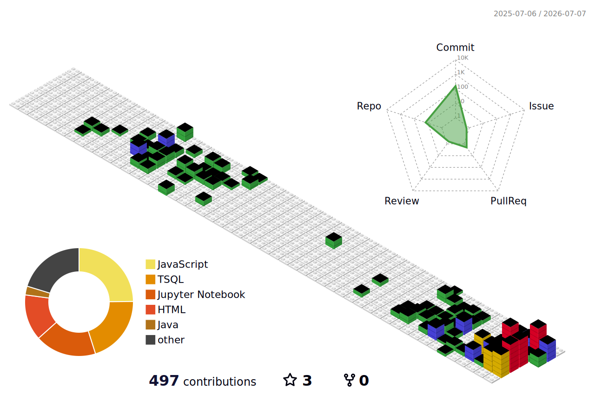

<h2 align="center">Arthur Rosisca</h2>

Desenvolvedor Full-Stack

  
  
  

 

<table align="center" width="100%" border="0" cellpadding="8">
  <tr>
    <!-- Coluna Sobre Mim -->
    <td width="50%" valign="top">
      <h3>Sobre Mim</h3>
      
Estudante de Ciência da Computação na <strong>UTFPR</strong> focado em Desenvolvimento Web Full-Stack e Engenharia de Dados. Atuo no desenvolvimento de sistemas web tolerantes a falhas, modelagem de bancos de dados relacionais e pipelines de processamento espacial.

      <ul>
        <li>Desenvolvimento focado no ecossistema PHP (Laravel 12 / Inertia.js / Vue 3).</li>
        <li>Construção de integrações assíncronas, webhooks e gerenciamento de filas.</li>
        <li>Pesquisa acadêmica aplicada em Process Mining e inteligência espacial.</li>
      </ul>
    </td>
    <!-- Divisória Vertical Central -->
    <td width="2%" style="border-left: 1px solid #30363d;"></td>
    <!-- Coluna Tecnologias -->
    <td width="48%" valign="top">
      <h3>Tech Stack</h3>
      

        <strong>Backend:</strong> Laravel • PHP • Python • FastAPI 
        <strong>Frontend:</strong> Vue 3 • React • Three.js • Zustand 
        <strong>Bancos & Dados:</strong> PostgreSQL • MySQL • Pandas • SQL 
        <strong>DevOps:</strong> Docker • Git • Jira • Linux
      

    </td>
  </tr>
</table>

 

  

