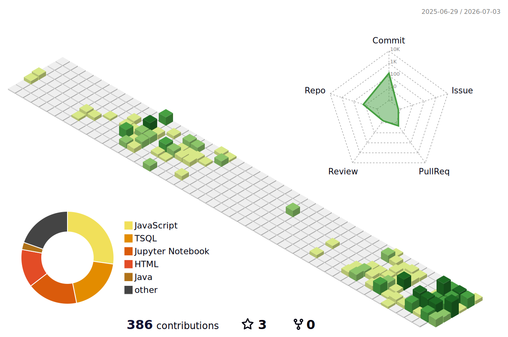

y

<h2 align="center">Arthur Rosisca</h2>

Desenvolvedor Full-Stack

  
  
  

 

<table align="center" width="100%" border="0" cellpadding="8">
  <tr>
    <!-- Coluna Sobre Mim -->
    <td width="38%" valign="top">
      <h3>Sobre Mim</h3>
      
Estudante de Ciência da Computação na <strong>UTFPR</strong>. Atuo na intersecção entre Desenvolvimento Full-Stack e Engenharia de Dados.

      <ul>
        <li>Estagiário Full-Stack na <strong>Soma Tecnologia</strong> (Laravel 12 / Vue 3).</li>
        <li>Foco em SaaS, webhooks, filas assíncronas e ETL.</li>
        <li>Pesquisa aplicada em Process Mining e algoritmos espaciais.</li>
      </ul>
    </td>
    <!-- Coluna Tecnologias -->
    <td width="34%" valign="top">
      <h3>ech Stack</h3>
      

        <strong>Backend:</strong> Laravel • PHP • Python • FastAPI 
        <strong>Frontend:</strong> Vue 3 • React • Three.js • Zustand 
        <strong>Bancos & Dados:</strong> PostgreSQL • MySQL • Pandas • SQL 
        <strong>DevOps:</strong> Docker • Git • Jira • Linux
      

    </td>
    <!-- Coluna Streak Stats -->
    <td width="28%" valign="top">
      <h3>Contribuições</h3>
      
    </td>
  </tr>
</table>

 

<table align="center" width="100%" border="0" cellpadding="8">
  <tr>
    <!-- Coluna 3D Contrib -->
    <td width="50%" align="center" valign="top">
      
    </td>
    <!-- Coluna Activity Graph -->
    <td width="50%" align="center" valign="top">
      <h3>Gráfico de Atividade</h3>
      
    </td>
  </tr>
</table>

 

  

